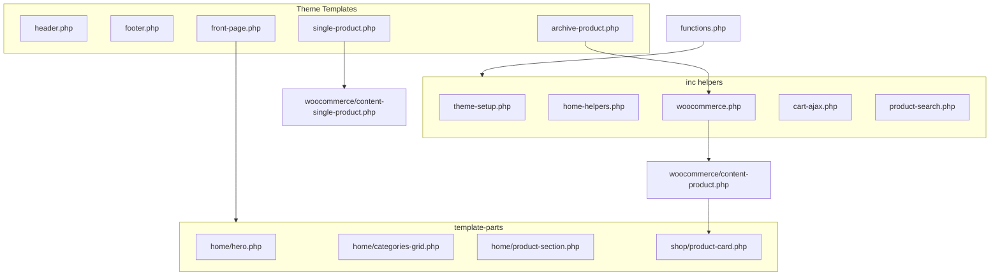

# Buity Theme — Implementation Plan

> Saved implementation plan for the Buity WooCommerce theme.  
> Target install path: `wp-content/themes/buity/`

## Context

- **Target install path:** `/var/www/html/buity/wp-content/themes/buity-theme/`
- **Current workspace** (`buity`) — greenfield build.
- **Reference only:** `kids-shop` shows proven WooCommerce patterns (`wc_get_products`, cart fragments, `content-product.php` delegation) but its header/footer are scraped Angular markup — **do not copy** that HTML. buity will use native WordPress/WooCommerce markup.

## Architecture



## Implementation todos

| ID | Task | Status |
|----|------|--------|
| scaffold-theme | Create buity-theme folder, style.css header, functions.php bootstrap, index/page/404/search.php | done |
| theme-setup-enqueue | Implement inc/theme-setup.php (WC support, menus, logo) and inc/enqueue.php (conditional CSS/JS) | done |
| header-footer | Build semantic header.php/footer.php with template-parts (nav, search, cart, footer columns) | done |
| woocommerce-core | Add inc/woocommerce.php hooks, content-product.php, product-card partial, archive-product.php, single templates | done |
| homepage | Implement inc/home-helpers.php, front-page.php, hero/categories/product-section template-parts | done |
| ajax-cart-search | Add inc/cart-ajax.php + cart.js fragments; product search form + search.php + pre_get_posts | done |
| customizer-styles | Add inc/customizer.php for hero/footer settings; complete main/home/shop/product CSS and responsive menu | done |

## Folder structure

```
buity-theme/
├── style.css                 # Theme header + CSS variables
├── functions.php             # Bootstrap, enqueue, requires inc/*
├── index.php
├── header.php
├── footer.php
├── front-page.php
├── archive-product.php       # Shop/category layout
├── single-product.php        # Wrapper → wc content-single-product
├── page.php                  # Generic pages
├── search.php                # Product search results
├── 404.php
├── screenshot.png            # 1200×900 theme preview (optional)
├── assets/
│   ├── css/
│   │   ├── main.css          # Layout, header, footer, grid
│   │   ├── home.css
│   │   ├── shop.css
│   │   └── product.css
│   └── js/
│       ├── theme.js          # Mobile nav, utilities
│       ├── cart.js           # AJAX add to cart + fragment refresh
│       └── search.js         # Optional live suggestions (basic)
├── inc/
│   ├── theme-setup.php       # Supports, menus, image sizes
│   ├── enqueue.php           # Styles/scripts + localize
│   ├── home-helpers.php      # Hero + WC product queries
│   ├── woocommerce.php       # WC hooks, columns, wrappers
│   ├── cart-ajax.php         # Fragments + cart count markup
│   └── customizer.php        # Hero, footer contact, social URLs
├── template-parts/
│   ├── header/
│   │   ├── branding.php
│   │   ├── navigation.php
│   │   ├── search-form.php
│   │   └── cart-icon.php
│   ├── footer/
│   │   ├── about.php
│   │   ├── quick-links.php
│   │   ├── contact.php
│   │   └── social.php
│   ├── home/
│   │   ├── hero.php
│   │   ├── categories-grid.php
│   │   └── product-section.php
│   └── shop/
│       └── product-card.php
└── woocommerce/
    ├── content-product.php   # Loop item → product-card partial
    ├── content-single-product.php
    └── single-product.php    # WC-standard wrapper (if needed)
```

## 1. Theme identity and bootstrap

### `style.css`
- WordPress theme header: **Theme Name:** buity Theme, **Text Domain:** `buity-theme`, **Requires at least:** 6.0, **WC tested up to:** latest stable.
- CSS custom properties at `:root`:
  - `--color-bg: #ffffff`
  - `--color-accent-pink: #f4d4dc` / `--color-accent-green: #c8e6c9`
  - `--color-primary: #2e7d5a` (CTA, links)
  - `--color-text: #1a1a1a`
  - `--shadow-card: 0 4px 20px rgba(0,0,0,.08)`
  - `--container-max: 1200px`
- Enqueue separate CSS files from `inc/enqueue.php` with `filemtime()` cache busting.

### `functions.php`
- `ABSPATH` guard; load inc files in order: setup → enqueue → woocommerce → home-helpers → cart-ajax → customizer.
- No placeholder stubs — each require maps to working code.

## 2. Theme support and menus — `inc/theme-setup.php`

| Feature | Implementation |
|---------|----------------|
| WooCommerce | `add_theme_support( 'woocommerce', array( 'thumbnail_image_width' => 400, 'single_image_width' => 600, 'product_grid' => … ) )` |
| Custom logo | `add_theme_support( 'custom-logo', array( 'height' => 80, 'flex-width' => true ) )` |
| Featured images | `post-thumbnails` + `woocommerce` image sizes |
| Menus | `primary` (header), `footer` (quick links) via `register_nav_menus()` |
| HTML5 | `search-form`, `gallery`, `caption`, `script`, `style` |
| Title tag | `title-tag` |

**Image sizes:** `buity-product-card` (400×400 crop), `buity-hero` (1600×600).

## 3. Header — `header.php` + template-parts

Semantic structure:

```html
<header class="site-header">
  <div class="container site-header__inner">
    <!-- logo (custom_logo or site name) -->
    <!-- primary nav + mobile toggle -->
    <!-- product search form -->
    <!-- cart link + count badge -->
  </div>
</header>
```

- **Logo:** `the_custom_logo()` with text fallback `bloginfo( 'name' )`.
- **Navigation:** `wp_nav_menu( array( 'theme_location' => 'primary', 'menu_class' => 'primary-menu', 'container' => 'nav' ) )`.
- **Search:** GET form → `home_url( '/' )` with `name="s"`, hidden `post_type=product`; reuse on mobile inside slide-out panel.
- **Cart:** Link to `wc_get_cart_url()`; count span `.buity-cart-count` updated via fragments.
- **Mobile menu:** Hamburger toggles `.primary-menu--open` on `<body>`; `theme.js` handles `aria-expanded`, click-outside close, ESC key.

## 4. Footer — `footer.php` + template-parts

Four-column grid (stacks on mobile):

| Column | Content |
|--------|---------|
| About | Site tagline + short text from Customizer `buity_footer_about` |
| Quick links | `wp_nav_menu( 'footer' )` fallback hardcoded Shop / My Account / Cart |
| Contact | Phone, email, address from Customizer |
| Social | Facebook, Instagram, WhatsApp URLs from Customizer with `rel="noopener"` |

Copyright row: `© {year} {site_name}`.

## 5. Homepage — `front-page.php`

`get_header()` → main sections → `get_footer()`:

1. **Hero** — `template-parts/home/hero.php`
   - Background image, headline, subtext, CTA button from Customizer (`buity_hero_*`).
   - Fallback gradient if no image uploaded.

2. **Categories grid** — `template-parts/home/categories-grid.php`
   - `get_terms( 'product_cat', array( 'hide_empty' => true, 'parent' => 0, 'number' => 8 ) )`.
   - Thumbnail via `get_term_meta( $id, 'thumbnail_id' )` + `wp_get_attachment_image()`.
   - Link: `get_term_link( $term )`.

3. **Product sections** (each uses `template-parts/home/product-section.php`):
   - **Featured** — `wc_get_products( array( 'featured' => true, 'limit' => 8 ) )`
   - **On sale** — `wc_get_products( array( 'on_sale' => true, 'limit' => 8 ) )`
   - **Latest** — `wc_get_products( array( 'orderby' => 'date', 'order' => 'DESC', 'limit' => 8 ) )`

Helper: `buity_get_home_sections()` in `inc/home-helpers.php`; filterable via `buity_home_sections`.

## 6. WooCommerce templates

### Shop archive — `archive-product.php`
- `woocommerce_before_main_content` / `after_main_content` hooks.
- Product grid: `ul.products` with theme column class.
- `woocommerce_pagination()`.

### Product loop — `woocommerce/content-product.php`
Delegates to `template-parts/shop/product-card.php`.

### Product card
- Image, title, price, discount badge, add to cart (AJAX for simple products).

### Single product
- Root `single-product.php` + `woocommerce/content-single-product.php` with default WC hooks in a two-column grid.

### `inc/woocommerce.php` hooks
- Remove default sidebar; 4 columns shop; 12 products per page; gallery support.

## 7. Design system (CSS)

Vanilla CSS — white + soft pink/green accents, card shadows, responsive grid at 768px / 1024px. Conditional enqueues per page type.

## 8. AJAX add to cart

WooCommerce `wc-add-to-cart` + `wc-cart-fragments`; filter `woocommerce_add_to_cart_fragments` for `.buity-cart-count`; `cart.js` toast on `added_to_cart`.

## 9. Product search

Header form `?s=&post_type=product`; `search.php` product grid; `pre_get_posts` for product-only search.

## 10. Customizer

Hero, footer about/contact, social URLs, promo bar — via `inc/customizer.php`.

## 11. Performance and standards

Escaping, i18n (`buity-theme`), no Angular/Lottie assets from kids-shop.

## 12. Activation checklist

1. Place theme in `wp-content/themes/buity-theme/`
2. Activate WooCommerce
3. Static front page for Home
4. Assign Primary + Footer menus
5. Customizer: logo, hero, contact
6. Product categories + featured/sale products
7. Test cart AJAX, search, mobile menu

## Out of scope

- Checkout/cart redesign
- Page builders
- Bengali `.pot` (later)
- Duplicate admin settings page

## Implementation order

1. `style.css` + `inc/theme-setup.php` + `functions.php`
2. `header.php` / `footer.php` + `main.css` / `theme.js`
3. WooCommerce templates + product card
4. Homepage helpers + `front-page.php`
5. Archive + single product
6. Cart AJAX + `search.php`
7. Customizer + remaining CSS
